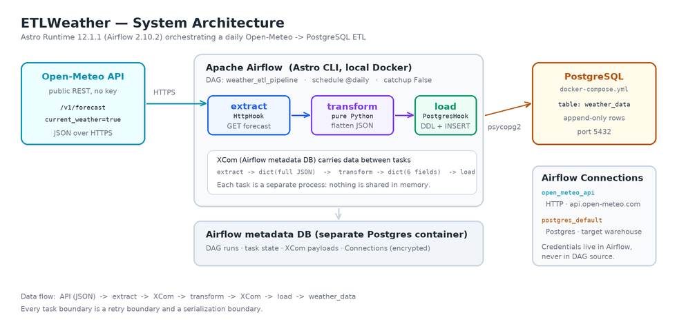
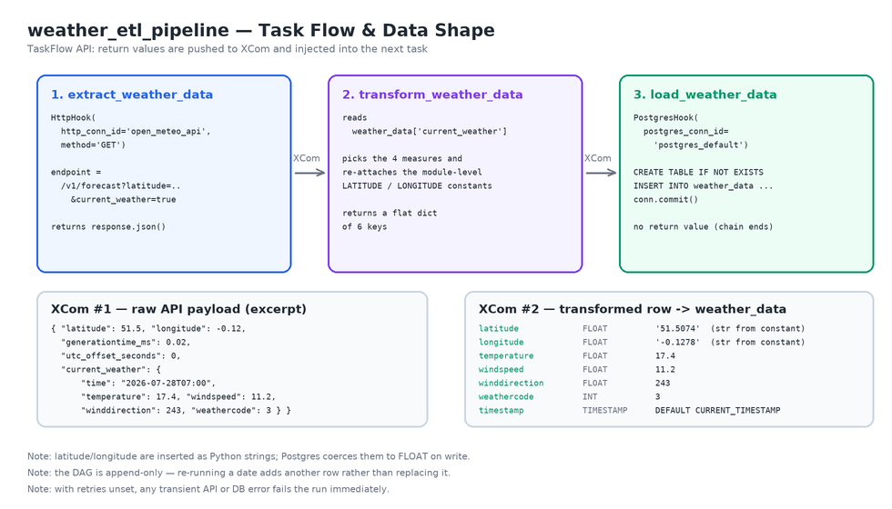

# Case Study — ETLWeather

**An Apache Airflow ETL pipeline that ingests current weather observations from the Open-Meteo API into PostgreSQL.**

| | |
|---|---|
| **Repository** | `Sylvester-Stanley/ETLWeather` |
| **Pipeline (DAG) ID** | `weather_etl_pipeline` |
| **Orchestrator** | Apache Airflow 2.10.2 via Astro Runtime 12.1.1 |
| **Source system** | Open-Meteo Forecast API (public REST, no API key) |
| **Target system** | PostgreSQL 13 (`weather_data` table) |
| **Schedule** | `@daily`, `catchup=False` |
| **Pattern** | Classic three-stage ETL (Extract → Transform → Load) |
| **Analysis date** | 28 July 2026 |

---

## 1. Executive summary

ETLWeather is a compact, production-shaped reference implementation of the most common pattern in data engineering: pull data from a third-party HTTP API on a schedule, reshape it, and land it in a relational database. It is built on the Astronomer distribution of Apache Airflow and uses Airflow's TaskFlow API to express the pipeline as three decorated Python functions.

The project's real value is pedagogical density. In roughly 90 lines of DAG code it demonstrates connection abstraction via Hooks, implicit inter-task data passing via XCom, declarative scheduling, and idempotent DDL — the same building blocks used in pipelines that are thousands of lines long.

**Verified findings from this analysis.** The DAG parses cleanly against Airflow 2.10.2 with zero import errors, and all three task callables execute correctly end-to-end when driven with mocked hooks; the SQL is valid PostgreSQL. However, four issues were confirmed by execution rather than inspection:

1. **The repository's own test suite fails on this DAG.** `tests/dags/test_dag_example.py` asserts every DAG has tags and `retries >= 2`. `weather_etl_pipeline` has neither, so two tests fail — one with a raw `TypeError` rather than the intended assertion message.
2. **No retries are configured**, so a single transient network blip fails the run. This is the highest-impact gap for a pipeline whose first task is a call over the public internet.
3. **`postgres_default` is a reserved connection ID that Airflow pre-creates pointing at its own metadata database.** Unless it is explicitly overridden, the pipeline writes `weather_data` into Airflow's internal database instead of the intended warehouse — a silent correctness failure, not a visible error.
4. **The bundled `docker-compose.yml` cannot serve this DAG as written.** It defines a Postgres container in a separate Compose project that is not attached to the Airflow network, so Airflow cannot resolve it by service name.

Sections 6 and 7 quantify these; the companion **[Implementation Guide](IMPLEMENTATION_GUIDE.md)** provides a step-by-step runbook that resolves all four while leaving the DAG's logic intact.

---

## 2. Business context and problem statement

Weather is a common *exogenous variable* — a factor that sits outside a business but measurably drives its outcomes. Retail footfall, energy load, agricultural yield, delivery-fleet routing and insurance-claim volume all correlate with temperature, wind and precipitation.

The obstacle is that weather APIs serve *current conditions*. They answer "what is it doing right now?" and then forget. Analytics needs the opposite: a durable, append-only history that can be joined against sales, load or claims data over months. Nobody can query the past from an API that only knows the present.

**The problem this pipeline solves:** convert an ephemeral, request-response weather API into a persistent, queryable time series, on an unattended schedule, without manual intervention.

### Why Airflow rather than a cron job

A `cron` entry calling a Python script would technically satisfy the requirement. Airflow is chosen because scheduled data movement has failure modes that cron does not address:

| Concern | `cron` + script | Airflow |
|---|---|---|
| A step fails midway | Whole script re-runs, or silently dies | Failed **task** is retried in isolation; upstream successes are preserved |
| Did last night's run succeed? | Grep the logs, if any were kept | Colour-coded run history in the UI, queryable via metadata DB |
| Credentials | Hard-coded, or a `.env` read by hand | Centralised **Connections**, encrypted with Fernet, injected at runtime |
| Backfilling a missed week | Bespoke loop and date arithmetic | Native `catchup` / `backfill` over logical dates |
| Observability | `print()` to a file | Per-task logs, duration trends, SLA misses, alerting hooks |
| Dependencies between steps | Implicit line ordering | Explicit DAG; Airflow enforces order and parallelism |

The pipeline is small enough that these benefits look like overhead. They stop looking like overhead the first time the API returns a 503 at 03:00.

---

## 3. Architecture



### 3.1 Components

**Open-Meteo Forecast API (source).** A free weather service requiring no API key or signup for non-commercial use. The DAG calls `/v1/forecast` with `current_weather=true`, which returns a compact JSON document containing a `current_weather` object with temperature, wind speed, wind direction and a WMO weather code.

**Astro Runtime 12.1.1 (orchestration).** Astronomer's packaged Airflow distribution. Version 12.1.1 was released 20 September 2024 and ships **Apache Airflow 2.10.2** on Python 3.12 by default. Relevant to this project, it pre-installs `apache-airflow-providers-http` 4.13.0 and `apache-airflow-providers-postgres` 5.12.0 — which is why `requirements.txt` is empty and the DAG's imports still resolve. Locally, `astro dev start` runs four containers: webserver, scheduler, triggerer, and a Postgres for Airflow's own metadata.

**PostgreSQL 13 (target).** The analytical destination. Critically, this must be a *separate* database from Airflow's metadata store — see §6.3.

### 3.2 Connection abstraction

The DAG names two connections but defines neither:

```python
POSTGRES_CONN_ID = 'postgres_default'
API_CONN_ID      = 'open_meteo_api'
```

These are lookup keys. At runtime, Airflow resolves each ID through its secrets chain — environment variables first, then any configured secrets backend, then the metadata database — and hands the task a ready-made, authenticated client. The benefit is that hostnames, ports and passwords never appear in version control, and the same DAG file promotes from laptop to staging to production unchanged: only the connection definitions differ per environment.

---

## 4. Pipeline walkthrough



### 4.1 DAG definition

```python
default_args = {
    'owner': 'airflow',
    'start_date': days_ago(1)
}

with DAG(dag_id='weather_etl_pipeline',
         default_args=default_args,
         schedule_interval='@daily',
         catchup=False) as dags:
```

`catchup=False` is a deliberate and correct choice here. With catchup enabled, Airflow would try to create a run for every missed interval since `start_date`. That is valuable for historical data, but meaningless for this pipeline: the endpoint only ever returns *current* conditions, so backfilled runs would each fetch today's weather and mislabel it as a past date.

`days_ago(1)` is a *dynamic* start date, re-evaluated every time the file is parsed. Airflow deprecated this function precisely because a moving start date makes run boundaries non-reproducible; a fixed `pendulum.datetime(2024, 1, 1)` is the modern equivalent. Confirmed at parse time on Airflow 2.10.2:

> `RemovedInAirflow3Warning: Function 'days_ago' is deprecated and will be removed in Airflow 3.0.`
> `RemovedInAirflow3Warning: Param 'schedule_interval' is deprecated ... Please use 'schedule' instead.`

Both are warnings today and hard errors on Airflow 3.

### 4.2 Task 1 — Extract

```python
@task()
def extract_weather_data():
    """Extract weather data from Open-Meteo API using Airflow Connection."""
    http_hook = HttpHook(http_conn_id=API_CONN_ID, method='GET')
    endpoint = f'/v1/forecast?latitude={LATITUDE}&longitude={LONGITUDE}&current_weather=true'
    response = http_hook.run(endpoint)

    if response.status_code == 200:
        return response.json()
    else:
        raise Exception(f"Failed to fetch weather data: {response.status_code}")
```

`HttpHook` supplies the base URL from the connection and joins it with the endpoint. Verified resolution:

```
https://api.open-meteo.com/v1/forecast?latitude=51.5074&longitude=-0.1278&current_weather=true
```

**A subtlety worth naming.** The explicit `status_code == 200` check is mostly unreachable. `HttpHook.run()` calls `check_response()` by default, which invokes `raise_for_status()` and converts any 4xx/5xx into an `AirflowException` *before* control returns. The `else` branch therefore fires only for non-200 success codes such as `204`. The check is harmless and arguably self-documenting, but the error a user actually sees on a server error is Airflow's, not the DAG's.

The task returns the entire parsed JSON document. Under the TaskFlow API this return value is serialised to XCom automatically.

### 4.3 Task 2 — Transform

```python
@task()
def transform_weather_data(weather_data):
    """Transform the extracted weather data."""
    current_weather = weather_data['current_weather']
    transformed_data = {
        'latitude': LATITUDE,
        'longitude': LONGITUDE,
        'temperature': current_weather['temperature'],
        'windspeed': current_weather['windspeed'],
        'winddirection': current_weather['winddirection'],
        'weathercode': current_weather['weathercode']
    }
    return transformed_data
```

This is the *T* of ETL in its most literal form: discard the envelope, keep the payload, flatten to one row. Fields such as `generationtime_ms`, `elevation` and `utc_offset_seconds` are dropped as operational metadata.

**A behaviour worth documenting.** Latitude and longitude are re-attached from the module-level constants rather than read from the response. This matters because Open-Meteo snaps requests to its model grid — asking for `51.5074` yields `"latitude": 51.5` in the response. The pipeline therefore records *what was requested*, not *what was returned*. That is defensible (the requested point is the stable business key), but it should be a conscious decision, because the stored coordinate does not identify the grid cell the measurements actually describe. A regression test in `tests/dags/test_weather_etl.py` pins this behaviour so it cannot change silently.

The two constants are also Python **strings**, while the target columns are `FLOAT`. PostgreSQL coerces them on insert, so no error surfaces — verified: `'51.5074'` lands as `51.5074`.

### 4.4 Task 3 — Load

```python
@task()
def load_weather_data(transformed_data):
    """Load transformed data into PostgreSQL."""
    pg_hook = PostgresHook(postgres_conn_id=POSTGRES_CONN_ID)
    conn = pg_hook.get_conn()
    cursor = conn.cursor()

    cursor.execute("""
    CREATE TABLE IF NOT EXISTS weather_data (
        latitude FLOAT, longitude FLOAT, temperature FLOAT,
        windspeed FLOAT, winddirection FLOAT, weathercode INT,
        timestamp TIMESTAMP DEFAULT CURRENT_TIMESTAMP
    );
    """)

    cursor.execute("""
    INSERT INTO weather_data (latitude, longitude, temperature, windspeed, winddirection, weathercode)
    VALUES (%s, %s, %s, %s, %s, %s)
    """, (...))

    conn.commit()
    cursor.close()
```

`CREATE TABLE IF NOT EXISTS` makes the pipeline self-bootstrapping: a fresh database needs no manual setup. The insert is correctly **parameterised** with `%s` placeholders, so psycopg2 handles escaping and the code is not SQL-injectable.

Two observations:

- **`timestamp` records insert time, not observation time.** The column defaults to `CURRENT_TIMESTAMP`, while the API's own `current_weather.time` field is discarded during transform. The stored time answers "when did we write this?" rather than "when was this measured?" — a meaningful distinction if a run is retried hours late.
- **`conn.close()` is never called.** The cursor is closed but the connection is not, and there is no `try/finally`. In practice Airflow tears down the worker process after each task, so the socket is reclaimed; it is untidy rather than dangerous.

### 4.5 Dependency graph

```python
weather_data = extract_weather_data()
transformed_data = transform_weather_data(weather_data)
load_weather_data(transformed_data)
```

No `>>` operators appear. The TaskFlow API infers the graph from the flow of function arguments: passing `weather_data` into `transform_weather_data` *is* the dependency declaration. Verified structure:

```
extract_weather_data → transform_weather_data → load_weather_data
```

---

## 5. Verification performed

Findings in this document were produced by executing the code, not only reading it. Airflow **2.10.2** — the exact version in Astro Runtime 12.1.1 — was installed and the DAG was loaded through a real `DagBag`.

| Check | Method | Result |
|---|---|---|
| DAG parses | `DagBag` import against Airflow 2.10.2 | **Pass** — `import_errors: {}` |
| Graph shape | Inspect `downstream_task_ids` | **Pass** — linear 3-task chain |
| Schedule / catchup | Inspect DAG attributes | **Pass** — `@daily`, `catchup=False` |
| Endpoint construction | `HttpHook.url_from_endpoint()` | **Pass** — correct absolute URL |
| Task callables | Executed all three with hooks patched | **Pass** — full E→T→L run |
| Load SQL | Real DDL + INSERT replayed on SQLite | **Pass** — row stored as `(51.5074, -0.1278, 17.4, 11.2, 243.0, 3)` |
| SQL dialect | Parsed with `sqlglot` (postgres) | **Pass** — valid |
| Deprecations | Warning capture at parse | **2 found** — `days_ago`, `schedule_interval` |
| Retries configured | Inspect `default_args` | **Fail** — unset (`retries: 0`) |
| Tags present | Inspect `dag.tags` | **Fail** — empty |
| Repo test suite | `pytest tests/` with `AIRFLOW_HOME` at project root | **2 failed, 3 passed** |

The failing suite output:

```
FAILED tests/dags/test_dag_example.py::test_dag_tags[dags/etlweather.py]
    AssertionError: weather_etl_pipeline in dags/etlweather.py has no tags
FAILED tests/dags/test_dag_example.py::test_dag_retries[dags/etlweather.py]
    TypeError: '>=' not supported between instances of 'NoneType' and 'int'
```

The second failure is doubly informative: not only are retries unset, but the test itself is brittle — `dag.default_args.get("retries", None)` returns `None`, and comparing `None >= 2` raises `TypeError` instead of producing the intended assertion message.

> **Note on `AIRFLOW_HOME`.** These tests only fail when `AIRFLOW_HOME` points at the project root. Otherwise `DagBag` finds no DAGs, every parametrised case is skipped, and the suite reports a misleading pass. This is itself a finding: **a green test run does not prove the DAGs were tested.**

---

## 6. Findings and recommendations

### 6.1 No retry policy — *high severity*

`default_args` sets only `owner` and `start_date`. Every task therefore inherits `retries = 0` (confirmed by inspection). A pipeline whose first action is an HTTPS call to a free public API will encounter transient failures; with no retries, each one is a hard failure requiring manual intervention.

```python
default_args = {
    'owner': 'airflow',
    'start_date': pendulum.datetime(2024, 1, 1, tz="UTC"),
    'retries': 3,
    'retry_delay': timedelta(minutes=5),
    'retry_exponential_backoff': True,
}
```

This also satisfies the repository's existing `test_dag_retries` check.

### 6.2 Not idempotent — *high severity*

The load task performs a bare `INSERT` with no unique key and no delete-before-insert. Re-running a date — routine after a failure, and the standard "clear and retry" gesture in the Airflow UI — appends a **duplicate row**. This is proven by a dedicated regression test (`test_load_is_append_only_so_reruns_duplicate_rows`), which asserts a count of 2 after two identical loads.

Idempotency is the property that running a task twice leaves the same end state as running it once. Without it, downstream aggregates such as `AVG(temperature)` silently skew toward whichever days happened to be retried. The fix is a natural key plus an upsert:

```sql
ALTER TABLE weather_data
    ADD CONSTRAINT weather_data_pk PRIMARY KEY (latitude, longitude, observation_time);

INSERT INTO weather_data (...) VALUES (...)
ON CONFLICT (latitude, longitude, observation_time) DO UPDATE
   SET temperature = EXCLUDED.temperature, ...;
```

This requires preserving the API's `current_weather.time` as `observation_time` — which also resolves the observation-time-versus-insert-time ambiguity in §4.4.

### 6.3 `postgres_default` collides with an Airflow built-in — *high severity, silent*

Airflow pre-creates a connection named `postgres_default` in its own metadata database. Its default definition, read directly from the Airflow 2.10.2 source, is:

```python
conn_id="postgres_default", conn_type="postgres",
login="postgres", password="airflow",
schema="airflow", host="postgres",
```

That points at **Airflow's internal database**. If a user starts the project and runs the DAG without redefining this connection, the task will very likely succeed — and create the `weather_data` table inside Airflow's metadata store. There is no error, no warning, and the data is mixed into the orchestrator's own schema, where `astro dev kill` will destroy it.

Two mitigations, both applied in the Implementation Guide: rename the connection to something unambiguous such as `weather_db_conn`, and/or define it explicitly as an environment variable, which takes precedence over the metadata-database entry.

### 6.4 The bundled `docker-compose.yml` does not serve this DAG — *medium severity*

The root `docker-compose.yml` starts a Postgres container in its **own Compose project**, on its own default network. Airflow, started separately by `astro dev start`, sits on the Astro-managed `airflow` bridge network. Containers on different bridge networks cannot resolve each other by service name, so a connection host of `postgres` fails from inside the scheduler.

The Astro CLI's supported mechanism is a `docker-compose.override.yml` at the project root, which is merged into the Astro Compose project. Attaching the warehouse to the `airflow` network makes it reachable at a stable hostname. This repository now ships that file.

### 6.5 Deprecated APIs — *medium severity*

Both `days_ago()` and `schedule_interval=` are deprecated in Airflow 2.10.2 and **removed in Airflow 3**. The DAG will not run on Airflow 3 without modification. Migration is mechanical:

| Current | Airflow 3 |
|---|---|
| `from airflow.utils.dates import days_ago` | `import pendulum` |
| `'start_date': days_ago(1)` | `'start_date': pendulum.datetime(2024, 1, 1, tz="UTC")` |
| `schedule_interval='@daily'` | `schedule='@daily'` |

### 6.6 No data-quality validation — *medium severity*

Whatever the API returns is written. A sensor fault yielding `-9999`, or a schema change dropping `windspeed`, propagates straight into the warehouse. A missing `current_weather` key raises a bare `KeyError` with no context (pinned by `test_transform_fails_loudly_when_current_weather_is_absent`). Range assertions before load — temperature within −90…60 °C, wind direction within 0…360° — turn silent corruption into a loud, actionable failure. These checks are implemented in `include/sql/verify_weather_data.sql` and in the smoke-test script.

### 6.7 Single hard-coded location — *low severity, design limit*

`LATITUDE` and `LONGITUDE` are module-level constants, so one DAG serves exactly one city. Scaling to fifty cities by copying the file fifty times would be unmaintainable. Airflow's **dynamic task mapping** is the idiomatic answer:

```python
CITIES = [
    {"name": "London",  "lat": "51.5074", "lon": "-0.1278"},
    {"name": "Mumbai",  "lat": "19.0760", "lon": "72.8777"},
]

@task
def extract_weather_data(city: dict): ...

extract_weather_data.expand(city=CITIES)
```

One DAG, one task definition, N parallel task instances — each independently retryable. This would require adding a `city` column to the table.

### 6.8 Housekeeping — *low severity*

- **Compiled bytecode was committed.** `dags/__pycache__/*.pyc` was tracked in Git; there was no `.gitignore`. Both are now fixed — untracking the `.pyc` files also removes a stale artefact compiled by Python 3.12.
- **Line endings.** `dags/etlweather.py` uses CRLF while `tests/` uses LF. Harmless, but a `.gitattributes` file would prevent cross-platform diff noise.
- **`airflow_settings.yaml` is an empty template** with null keys. Astro can error on malformed entries; the Implementation Guide uses `.env` instead, which is both safer and git-ignorable.

### 6.9 Priority summary

| # | Finding | Severity | Effort | Fix location |
|---|---|---|---|---|
| 6.1 | No retries | High | Trivial | `default_args` |
| 6.2 | Not idempotent (duplicates on re-run) | High | Moderate | Load task + schema |
| 6.3 | `postgres_default` collision | High | Trivial | Connection definition |
| 6.4 | Compose file unreachable from Airflow | Medium | Trivial | `docker-compose.override.yml` |
| 6.5 | Deprecated APIs (blocks Airflow 3) | Medium | Trivial | Imports + DAG kwargs |
| 6.6 | No data-quality checks | Medium | Moderate | New validation task |
| 6.7 | Single hard-coded location | Low | Moderate | Dynamic task mapping |
| 6.8 | Bytecode committed, no `.gitignore` | Low | Trivial | Repo hygiene |

---

## 7. What this project demonstrates well

It would be unfair to leave the impression that this is a flawed project. It is a *teaching* project, and it makes several correct decisions that are commonly got wrong:

- **Clean separation of E, T and L.** Each stage is an independently retryable unit. When the load fails, the extract does not re-run — no wasted API call, no re-fetch of data already in hand.
- **Hooks instead of hard-coded credentials.** No hostname or password appears in the source. This is the single most important habit to build early.
- **Parameterised SQL.** `%s` placeholders with a parameter tuple, not string concatenation. Injection-safe by construction.
- **Self-bootstrapping schema.** `CREATE TABLE IF NOT EXISTS` means a new environment works on first run.
- **Correct `catchup` semantics.** Disabling catchup for a current-conditions endpoint reflects genuine understanding of what backfill means.
- **A pure-Python transform.** The transform touches no I/O, which is exactly why it is trivially unit-testable — as the accompanying test suite demonstrates.

The gaps identified in §6 are, almost without exception, the *next* lesson rather than mistakes: retries, idempotency and data quality are what separate a working pipeline from a dependable one.

---

## 8. Conclusion

ETLWeather is a well-constructed teaching implementation of scheduled API-to-warehouse ETL. Its structure is sound, its use of Hooks and the TaskFlow API is idiomatic, and it runs correctly once its environment is configured properly.

Its production gaps cluster into two themes. **Reliability** — no retries and no idempotency — means the pipeline works when everything works, which is not the condition pipelines are judged on. **Environment correctness** — the `postgres_default` collision and the unreachable Compose service — means the most likely first-run outcome is either a connection error or, worse, data silently written to the wrong database.

Both themes are addressable without redesign. The [Implementation Guide](IMPLEMENTATION_GUIDE.md) supplies a verified, step-by-step runbook covering environment setup in VS Code, connection configuration, execution, verification and troubleshooting, plus a fast local test suite that runs without Docker.

---

## Appendix A — Repository structure

```
ETLWeather/
├── dags/
│   ├── etlweather.py              # the weather_etl_pipeline DAG (analysed here)
│   └── exampledag.py              # Astronomer's stock astronaut example
├── tests/dags/
│   ├── test_dag_example.py        # stock integrity tests (tags, retries, imports)
│   └── test_weather_etl.py        # ADDED — unit tests for this DAG
├── include/
│   ├── sql/
│   │   ├── init_weather_db.sql    # ADDED — warehouse bootstrap schema
│   │   └── verify_weather_data.sql# ADDED — post-run verification queries
│   └── scripts/
│       └── smoke_test_pipeline.py # ADDED — Docker-free end-to-end check
├── docs/
│   ├── CASE_STUDY.md              # ADDED — this document
│   ├── IMPLEMENTATION_GUIDE.md    # ADDED — VS Code runbook
│   ├── images/                    # ADDED — architecture diagrams
│   └── tools/make_diagrams.py     # ADDED — diagram generator
├── docker-compose.yml             # original standalone Postgres (see §6.4)
├── docker-compose.override.yml    # ADDED — warehouse on the Airflow network
├── .env.example                   # ADDED — connection definitions template
├── .gitignore                     # ADDED
├── .vscode/                       # ADDED — editor + SQL client config
├── Dockerfile                     # FROM quay.io/astronomer/astro-runtime:12.1.1
├── requirements.txt               # empty; providers ship with the Runtime
└── airflow_settings.yaml          # empty Astro template
```

## Appendix B — `weather_data` schema

| Column | Type | Source | Note |
|---|---|---|---|
| `latitude` | `FLOAT` | DAG constant | Requested, not grid-snapped; passed as a string |
| `longitude` | `FLOAT` | DAG constant | Requested, not grid-snapped; passed as a string |
| `temperature` | `FLOAT` | `current_weather.temperature` | °C at 2 m |
| `windspeed` | `FLOAT` | `current_weather.windspeed` | km/h at 10 m |
| `winddirection` | `FLOAT` | `current_weather.winddirection` | Degrees clockwise from north |
| `weathercode` | `INT` | `current_weather.weathercode` | WMO code (0 clear, 3 overcast, 61 slight rain…) |
| `timestamp` | `TIMESTAMP` | `DEFAULT CURRENT_TIMESTAMP` | **Insert** time, not observation time (§4.4) |

No primary key, no unique constraint, no indexes — see §6.2.

## Appendix C — References

- Astro Runtime 12.1.1 release notes (Airflow 2.10.2, released 20 Sep 2024) — <https://www.astronomer.io/docs/runtime/runtime-release-notes>
- Astro Runtime provider package reference (http 4.13.0, postgres 5.12.0) — <https://www.astronomer.io/docs/runtime/runtime-provider-reference>
- Open-Meteo Forecast API documentation — <https://open-meteo.com/en/docs>
- Airflow: overriding the Astro CLI Compose file — <https://www.astronomer.io/docs/astro/cli/run-airflow-locally>
- Airflow: troubleshooting local port conflicts — <https://www.astronomer.io/docs/astro/cli/troubleshoot-locally>
- Airflow 3 migration: removal of `days_ago` — <https://github.com/apache/airflow/issues/41641>
